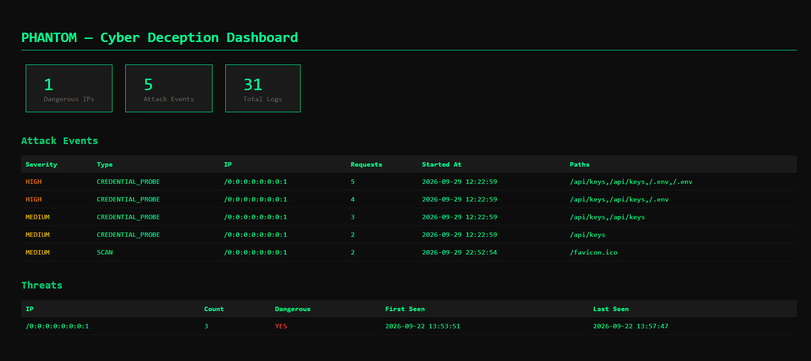

# Phantom 

**Cyber Deception System.** A honeypot-based intrusion deception system built in Java.
Phantom lures attackers into a fake environment, logs their every move,
and tracks dangerous IPs — all while the real service stays hidden.


---

# Project Structure

```text
org/phantom/
│
├── core/
│   ├── Gateway.java            ← Server entry point — accepts connections and dispatches to thread pool
│   ├── ClientHandler.java      ← Handles each client connection in a separate thread
│   └── Router.java             ← Routes requests to real or fake service based on path
│
├── http/
│   ├── HttpRequest.java        ← Parses raw HTTP requests including headers and client IP
│   ├── HttpResponse.java       ← Builds HTTP responses with status codes and body
│   └── JsonBuilder.java        ← Dependency-free JSON serializer with character escaping
│
├── security/
│   ├── RateLimiter.java        ← Token bucket algorithm — limits requests per IP per time window
│   ├── ConnectionLimiter.java  ← Limits concurrent connections per IP to prevent flood attacks
│   └── ThreatTracker.java      ← Tracks and persists dangerous IPs across server restarts
│
├── session/
│   ├── Session.java            ← Stores per-IP activity — paths visited, request count, timestamps
│   └── SessionManager.java     ← Manages all active sessions and provides lookup by IP
│
├── deception/
│   └── FakeService.java        ← Returns convincing fake responses per path to mislead attackers
│
└── infra/
    ├── Config.java             ← Loads and exposes all settings from config.properties
    └── Logger.java             ← Logs suspicious activity to console and file in JSON format
```

---

## How it works

When a client connects to Phantom:
- **Legitimate paths** → served normally
- **Suspicious paths** → routed to a fake service with convincing responses
- **Every suspicious request** → logged with IP, path, timestamp, and user-agent
- **Repeated attackers** → flagged as DANGER and permanently tracked

The attacker never knows they're being watched.

---

## Features

- **Honeypot** — lures attackers into fake services with convincing responses
- **Threat Tracking** — flags dangerous IPs and persists them across restarts
- **Session Tracking** — records full request history per IP
- **Attack Event Model** — detects and classifies attack patterns with severity
- **Rate Limiting** — blocks request flooding with token bucket algorithm
- **Connection Limiting** — prevents Slowloris and flood attacks
- **Structured Logging** — JSON logs to console and file
- **MySQL Persistence** — stores threats, sessions, logs, and attack events
- **Real-time Dashboard** — web UI for monitoring active threats and events

---

## Dashboard

Phantom comes with a built-in real-time dashboard.

The dashboard shows:
- **Dangerous IPs** — total IPs flagged as dangerous
- **Attack Events** — total detected attack patterns
- **Total Logs** — all suspicious requests logged
- **Attack Events table** — severity, type, IP, request count, and paths
- **Threats table** — all tracked IPs with first and last seen timestamps

---

## Session Tracking

Every IP is tracked across requests in a live session:
- First seen time
- Last seen time
- Total request count
- All visited paths

Session data is stored in memory and included in every log entry.

---

## Getting started

**Requirements:**
- Java 17+
- No external dependencies

**Run:**
```bash
# Clone the repo
git clone https://github.com/yourusername/phantom.git
cd phantom

# Compile
javac -d out src/org/phantom/*.java

# Run
java -cp out org.phantom.Gateway
```

**Test:**
```bash
# Normal request
curl http://localhost:8080/api/users

# Suspicious request (will be logged)
curl http://localhost:8080/admin
curl http://localhost:8080/.env
```

---

## Logs

All suspicious activity is logged to:
- **Console** — real-time monitoring
- **`phantom.log`** — persistent log file
- **`danger_ips.txt`** — permanently banned IPs (survive restarts)

Example log output:
```bash
[2026-09-19 15:01:42] [SUSPICIOUS] IP: /127.0.0.1 | Path: /admin | Agent: curl/8.21.0
[2026-09-19 15:02:10] [DANGER - Scanning detected! Count: 3] IP: /127.0.0.1 | Path: /.env | Agent: curl/8.21.0
```

---


I built this project solely for educational purposes related to security and networking. It certainly lacks the security required to protect sensitive data. I’d be happy if you used Phantom for your systems, but whatever happens is on you, buddy—not me. (lol).